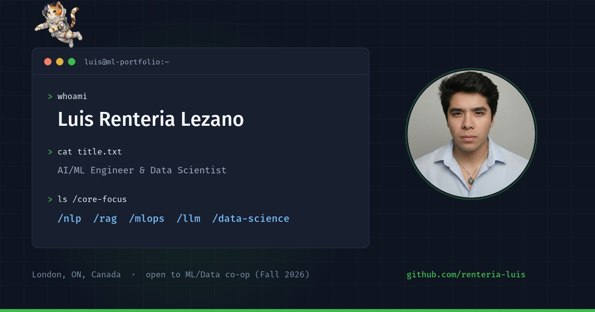

# luisrenteria.me

Personal portfolio of **Luis Renteria Lezano**, AI/ML Engineer in London, Ontario.

**[luisrenteria.me](https://luisrenteria.me)**



A single-page site built around a terminal metaphor, with a floating astronaut
cat that reacts to the section you are reading, a canvas neural-network
background, and a contact form that runs on a serverless function.

---

## Stack

| Layer | Choice | Why |
|---|---|---|
| Build | Vite 7 | Instant HMR, and the production bundle stays under 95 KB gzipped |
| UI | React 18 | No router: the whole site is one page |
| Styling | Tailwind CSS 3 | Utility classes plus a small hand-written layer in `src/index.css` |
| Icons | lucide-react, react-icons | Tree-shaken, only what is used ships |
| Backend | Vercel Serverless Function | One endpoint, `api/contact.js` |
| Email | Resend | 3.000 messages a month on the free tier |
| Anti-spam | Cloudflare Turnstile | Verified server-side, never trusted from the client |
| Validation | Zod | Same schema guards every field on the server |
| Hosting | Vercel | Immutable caching for `/public`, automatic HTTPS |

No CSS framework beyond Tailwind, no component library, no animation library.
Every animation in the site is hand-written against `requestAnimationFrame`.

---

## The parts worth reading

### The companion (`src/components/Companion.jsx`)

The astronaut cat drifts, blinks, comments on the section you are reading, and
can be dragged and flung. It went through one rewrite because the first version
felt laggy, and the fix is the interesting part:

- **Position is a critically damped spring integrated in seconds**, not a
  per-frame lerp. Replaying the model at 30, 60 and 144 Hz over 30 simulated
  seconds, the trajectories diverge by **0.44 px**. The original frame-rate
  dependent version diverged by 15.8 px, which is what made it look wrong on
  high-refresh displays.
- **The wander is layered sines at incommensurable rates**, so the path never
  repeats and never stalls. The previous version jumped to a random target and
  eased in slowly, which read as stutter even at a perfect 60 fps.
- **The loop only writes `transform` and `opacity`.** The speech bubble used to
  set `style.bottom` and `style.left` every frame; both are layout properties,
  so every frame invalidated layout for the whole document.
- Viewport and sprite sizes are cached and refreshed on resize. Reading
  `window.innerWidth` inside the loop forces a synchronous layout mid-frame.
- The loop parks itself when the tab is hidden.

### The background (`src/components/NeuralBackground.jsx`)

Two stacked canvases instead of one:

- `#neural-canvas` holds the graph. It never moves, so it is painted **once**
  per resize and then left alone.
- `#neural-pulses` holds only the travelling pulses, drawn from a pre-rendered
  sprite, clearing only the rectangles touched on the previous frame.

That turns roughly 150 path operations and 10 `createRadialGradient()` calls
per frame into about 10 small blits, which is main-thread time the companion
gets back. Both canvases render at device pixel ratio.

### The contact endpoint (`api/contact.js`)

A Vite SPA has no server, so every secret lives in this function. Ordered
defences:

1. **Honeypot**: an off-screen field a human never sees. If it is filled the
   endpoint answers `200` so the bot believes it succeeded and stops retrying.
2. **Time trap**: submissions faster than three seconds are flagged.
3. **Turnstile**: verified against Cloudflare's `siteverify`. The widget alone
   protects nothing; the token has to be checked on the server.
4. **Zod**: one schema, with length ceilings on every field.
5. **HTML escaping**: the message is escaped before it reaches the email body.

Spam signals are reported inside the email rather than used to silently drop
messages, so a false positive never costs a real opportunity.

The mail is sent `From:` the verified domain with `Reply-To:` set to the
visitor. Putting the visitor's address in `From` is the common mistake: DMARC
reads it as spoofing and the message bounces or lands in spam.

The form itself routes by intent (co-op, collaboration, technical question),
which changes both the visible fields and the email subject, and accepts deep
links so `?ref=linkedin&company=RBC&role=ML%20Intern` arrives pre-filled. On
success it returns a receipt with a message id, timestamp and SLA.

---

## Running it

```bash
npm install
npm run dev          # http://localhost:5173
npm run build        # -> dist/
npm run preview      # serve the production build
```

The contact form needs the serverless function, which `vite dev` does not run.
For the full thing locally:

```bash
npm i -g vercel
vercel dev
```

### Environment

Copy `.env.example` to `.env.local` and fill it in. The short version:

| Variable | Where | Purpose |
|---|---|---|
| `VITE_TURNSTILE_SITE_KEY` | client | Turnstile widget. Public by design |
| `RESEND_API_KEY` | server | Resend, sending access only |
| `TURNSTILE_SECRET_KEY` | server | Verifies the captcha token |
| `CONTACT_TO` | server | Inbox that receives submissions |
| `CONTACT_FROM` | server | Sender. Domain must be verified in Resend |
| `CONTACT_AUTOREPLY` | server | `1` to confirm to the sender. Off by default |

Anything prefixed `VITE_` is compiled into the public bundle. Everything else
is read only inside `api/`.

---

## Layout

```
api/contact.js            serverless endpoint: validate, verify, send
assets/originals/         source images, deliberately outside public/
public/                   shipped as-is: og.jpg, icons, CV, robots, sitemap
src/
  config/data.js          all content lives here. Editing the site means
                          editing this file, not the components
  components/
    Hero, About, Timeline, Projects, Skills, Contact, Footer, Nav
    Companion.jsx         the astronaut cat
    NeuralBackground.jsx  the two canvases
  hooks/useTypingEffect.js  typing effect + scroll reveal
  index.css               Tailwind layers plus the hand-written CSS
```

`src/config/data.js` is the single source of truth for every project, timeline
entry, skill and line of the cat's dialogue.

---

## Performance and SEO

- Images are WebP. The cat sprites went from 707 KB of PNG to 58 KB, the
  headshot from 76 KB to 11.5 KB.
- A 53 KB render-blocking icon stylesheet was being loaded from a third-party
  CDN on every visit and used zero times. Removing it took a whole cross-origin
  round trip off the critical path.
- The headshot is preloaded, since it is the Largest Contentful Paint element.
- Theme is applied by an inline script before first paint, so choosing light
  mode does not mean a dark flash on every load.
- `ProfilePage` + `Person` structured data, a real `<h1>`, canonical URL,
  sitemap and a generated 1200x630 social card.
- `prefers-reduced-motion` is honoured: the cat parks, the pulses stop and the
  reveal animations resolve immediately.
- Keyboard focus is visible everywhere and there is a skip link.

---

## License

**Not open source.** See [LICENSE](LICENSE).

You are welcome to read the code and borrow techniques. You may not reproduce
the design, deploy a copy, or reuse the personal content, which includes the
name, photograph, resume, project write-ups and the astronaut cat.
